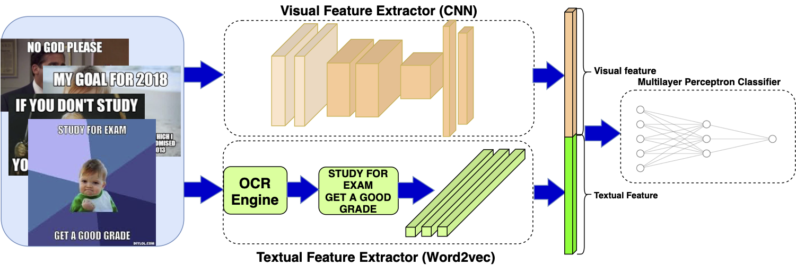

# Understanding Visual Memes: an Empirical Analysis of Text Superimposed on Memes Shared on Twitter

This repository contains code to reproduce the IWT meme classifier presented in the paper Understanding Visual Memes: an Empirical Analysis of Text Superimposed on Memes Shared on Twitter (ICWSM 2020):
 

 
Given a dataset of images shared on social media, we develop a two-step pipeline to identify IWT memes. The first step  of  our  pipeline  is  to use  the  Optical Character Recognition (OCR) engine Tesseract [1] to filter out all images that do not contain text. The second uses a supervised classifier to distinguish, amongst the remaining images, those that are IWT memes from thosethat are not. 

# Reference
[1] Smith, R., Antonova, D., & Lee, D. (2009). Adapting the Tesseract open source OCR engine for multilingual OCR. MOCR '09.
